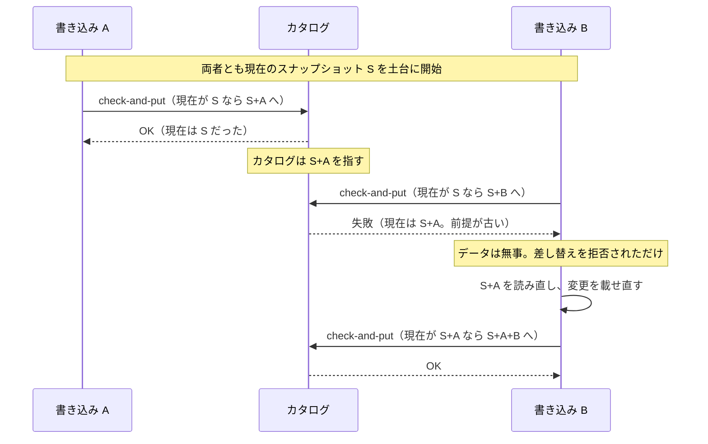
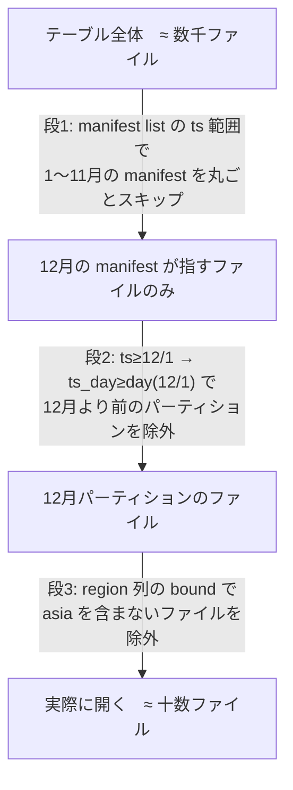

# 01. アーキテクチャと中核概念

**調査基準日: 2026-07-17** / **一次情報: [Apache Iceberg Table Spec](https://iceberg.apache.org/spec/)（生ソース: [`format/spec.md`](https://github.com/apache/iceberg/blob/main/format/spec.md)）**

> **出典についての注記**: `iceberg.apache.org/spec/` は JavaScript でページを組み立てる方式のため、本文をそのまま取り込めません。そこで本報告書は、同じ内容の生ソース（`apache/iceberg` の main ブランチにある `format/spec.md`、2137行）を出典としています。以降のドキュメントも同じ方針です。詳細は [99-methodology.md](99-methodology.md) を参照。

---

## Iceberg とは何か（そして何でないか）

Iceberg は**テーブルフォーマット**です。ファイルフォーマット（Parquet/ORC/Avro）でもストレージでもエンジンでもありません。「オブジェクトストレージ上に散らばったファイル群を、1つのテーブルとして正しく扱うためのメタデータの規約」がその実体です。

Hive テーブルとの根本的な違いは、仕様の Overview に明記されています。

> This table format tracks **individual data files** in a table instead of directories.

**ディレクトリではなくファイル単位で追跡する** — ここからほぼすべての設計上の帰結が導かれます。なぜそれが効くのか、順に見ていきます。

Hive 形式のテーブルは「このディレクトリの下にあるファイルが、このパーティションのデータ」という約束でデータの所在を表します。どのファイルがテーブルに属するかは、クエリのたびにディレクトリを一覧して確かめます。ところが S3 のようなオブジェクトストレージに本当のディレクトリは無く、「ディレクトリの一覧」は接頭辞を指定した LIST 操作にすぎません。この操作はファイル数に比例して遅く、ページングを伴います。かつては結果がすぐ反映されないことによる取りこぼしも起こり得ました。テーブルが大きくなるほど、この「毎回数える」コストが重くのしかかります。

Iceberg は、どのファイルがテーブルに属するかをメタデータ（マニフェスト）に明示的に書き留めます。クエリのプランニングはストレージを一覧する代わりに、このメタデータを読むだけで済みます。ここから3つの利点が生まれます。第一に**正確さ** — 一覧の網羅性や反映タイミングに左右されません。第二に**速さ** — ファイル数に比例した一覧走査が要りません（後述の[クエリプランニングの多段プルーニング](#クエリプランニングの多段プルーニング)につながります）。第三に、**ファイルの所在が「置き場所」から切り離されます**。あるファイルがどのパーティションに属するかは、ディレクトリのパスではなくメタデータに記録された値で決まります。そのためファイルをどこに置いても、パーティションの切り方を後から変えても、データを動かす必要も、クエリを書き換える必要もありません。クエリが参照するのはディレクトリのパスではなく論理的な列だからです。

---

## 三層のメタデータ構造

```
catalog                       … テーブル → 現 metadata ファイルへのポインタ
  └─ v<N>.metadata.json       … テーブル状態（JSON）
       └─ snapshot            … metadata.json 内に埋め込まれたリスト
            └─ manifest list  … snap-*.avro（1スナップショットに1つ）
                 └─ manifest  … *-m0.avro（データ用/削除用は分離）
                      └─ data file / delete file（Parquet/ORC/Avro/Puffin）
```

| 層 | ファイル名例 | フォーマット | 役割 |
|---|---|---|---|
| catalog | （外部） | メタストア/REST/DB | 現 metadata ファイルへのポインタを保持。**atomic swap の実行主体** |
| metadata file | `v<V>.metadata.json` または `<V>-<uuid>.metadata.json` | **JSON** | schema / spec / sort-order / snapshot 一覧 / properties |
| manifest list | `snap-<snapshot-id>-<n>.avro` | **Avro** | 1スナップショット分の manifest 一覧＋パーティション要約統計 |
| manifest | `<uuid>-m<n>.avro` | **Avro** | data file または delete file の一覧＋パーティション値＋列統計 |
| data file | `*.parquet` 等 | Parquet / ORC / Avro | 実データ |
| delete file / DV | `*-deletes.parquet` / `*.puffin` | Parquet/ORC/Avro / **Puffin** | 行レベル削除 |

仕様が明示する重要な性質:

- 「The data in a snapshot is the **union of all files in its manifests**.」
- 「Manifest files are **reused across snapshots** to avoid rewriting metadata that is slow-changing.」— マニフェストは変化の遅いメタデータを再利用する仕組みです。
- 「Manifests can track data files with **any subset of a table and are not associated with partitions**.」— **マニフェストはパーティションに紐づきません。** これは頻出する誤解です。

### マニフェストの制約

- 「A manifest may store either data files or delete files, **but not both** because manifests that contain delete files are **scanned first** during job planning.」— delete を先に読む必要があるため、分離されています。
- 「A manifest stores files for a **single partition spec**.」— manifest の Avro スキーマがパーティションスペックに依存するため、スペックが変わればファイルは別の manifest に書かれます。
- 「All columns must be written to data files even if they introduce redundancy with metadata（例: identity パーティション列）… provides a **backup in case of corruption or bugs in the metadata layer**.」— メタデータ層のバグに対する保険として、冗長でも全列を書きます。

### 具体例: 1回の追記で何が起きるか

抽象的なので、小さなテーブルに一度だけ追記した場合を追ってみます（以下のファイル名は説明用の例です）。

`db.events`（列は `event_id`, `region`, `ts`。`ts` の日付でパーティション）に、7月1日と7月2日にまたがる数行を1回 `INSERT` したとします。生成されるファイルはこうなります。

```
s3://warehouse/db/events/
├─ metadata/
│   ├─ 00001-8a1f….metadata.json     ← 追記後のテーブル状態。ここに snapshot が1つ
│   ├─ snap-73…-1-b2c….avro          ← manifest list（このスナップショット用に1つ）
│   └─ 0f9…-m0.avro                   ← manifest（下の2ファイルを列挙）
└─ data/
    ├─ ts_day=2026-07-01/00000-….parquet   ← 7/1 の行
    └─ ts_day=2026-07-02/00000-….parquet   ← 7/2 の行
```

このテーブルを読むエンジンは、次の順にたどります。

1. **カタログ**に「`db.events` の現在の metadata はどれか」を尋ね、`00001-8a1f….metadata.json` を得る。
2. その **metadata.json** を読み、現在のスナップショットが指す **manifest list**（`snap-73…-1-b2c….avro`）にたどり着く。
3. **manifest list** から、このスナップショットに属する **manifest**（`0f9…-m0.avro`）を得る。ここには各 manifest のパーティション要約統計も入っている。
4. **manifest** を読み、実際の **データファイル**2つと、それぞれの列統計・パーティション値を得る。

肝心なのは、**どのファイルがテーブルに属するかを、一度もストレージを一覧せずに確定できる**ことです。`data/` の下を `ls` して回るのではなく、メタデータをたどるだけで「読むべきは2ファイル」と分かります。2回目の追記をすると、新しい metadata.json・manifest list・manifest が増え、カタログのポインタがそちらへ差し替わります（[ACID と楽観的並行制御](#acid-と楽観的並行制御)）。古いスナップショットのファイルはそのまま残るので、[タイムトラベル](#タイムトラベルと2つの履歴)で過去の状態も読めます。

---

## ACID と楽観的並行制御

仕様の記述:

> An **atomic swap** of one table metadata file for another provides the basis for **serializable isolation**.

> Readers use the snapshot that was current when they load the table metadata and are **not affected by changes until they refresh**.

> Writers create table metadata files **optimistically**, assuming that the current version will not be changed before the writer's commit.

そして最も重要な一文:

> **The conditions required by a write to successfully commit determines the isolation level. Writers can select what to validate and can make different isolation guarantees.**

**分離レベルは固定ではなく、書き込み側の検証条件で決まります。** これは実務上きわめて重要な性質で、`write.*.isolation-level`（既定 `serializable`、`snapshot` に緩和可能）という設定が存在する理由でもあります。

設計目標として「**Readers will not acquire locks.**」が明記されています。読み手はロックを取りません。

### コミットの実装

**Metastore Tables**（推奨）:
1. 現メタデータを基に新メタデータを作成
2. `<V+1>-<random-uuid>.metadata.json` に書き出し
3. メタストアに **check-and-put** でポインタ swap を要求 → 成功なら commit 成立、失敗なら 1 に戻る

**File System Tables**（**使わないこと**）: atomic rename を使う方式ですが、仕様が明示的に deprecated とし、さらに「The scheme is **unsafe** in object stores and local file systems.」と述べ、**v4 で削除予定**としています。カタログ（metastore / REST）を使ってください。

> **重要**: 仕様は commit の atomic 操作自体を標準化していません。「The atomic operation used to commit metadata depends on how tables are tracked and **is not standardized by this spec**.」— **カタログ実装依存**です。これが REST Catalog 仕様（[03](03-rest-catalog.md)）が重要になる理由の一つです。

### 競合解決とリトライ

| 操作 | 検証条件 |
|---|---|
| **Append** | 「have no requirements and can **always** be applied.」— 常に適用可能 |
| **Replace** | 削除予定ファイルがまだテーブルにあることを検証（compaction 等） |
| **Delete** | 削除対象ファイルがまだテーブルにあることを検証。ただし**式ベースの削除（`where timestamp < X`）は常に適用可能** |
| **スキーマ/スペック更新** | base 版と current 版でスキーマが変わっていないことを検証 |

### 具体例: 2つの書き込みが同時に来たら

先ほどの `db.events` に、A と B が同時に追記しようとした場面を追ってみます。両者とも、いまカタログが指すスナップショット（仮に S とします）を土台にして書き始めます。



1. **A が先にコミット**: A は S に自分の追加ファイルを載せた新しい metadata を書き、カタログへ「**現在が S なら、これに差し替えて**」と check-and-put を要求する。カタログの現在は S なので成功。カタログは A のスナップショット（S+A）を指す。
2. **B のコミットは弾かれる**: B も S を土台に metadata を書き、「**現在が S なら差し替えて**」と要求する。しかしカタログの現在はもう S+A。**前提が崩れているので check-and-put は失敗する**（B が書いたデータが壊れるわけではなく、ポインタの差し替えが拒否されるだけ）。
3. **B はリトライ**: B はテーブルを読み直し、最新の S+A を土台に自分の変更を載せ直して再びコミットする。今度は現在が S+A なので成功し、カタログは S+A+B を指す。

ここで効いているのが、すぐ上の「競合解決とリトライ」の表です。A も B も **append**（ファイルを足すだけ）なので要求は「have no requirements」— **中身の衝突は起きません**。B が失敗したのは中身がぶつかったからではなく、単に「土台にしたスナップショットが古くなった」からで、載せ直せば必ず通ります。**待ちもロックも発生せず、負けた側が土台を更新してやり直すだけ**です。

これが **delete** だと話が変わります。B が「`event_id = 5` の行を含むファイルを消す」つもりでいても、その間に A が compaction でそのファイルを別のファイルへ書き換えていたら、B の前提（消す対象のファイルがまだある）は崩れ、リトライが必要になります。**何を検証するか＝どこまで厳しく衝突を見るかを、書き込み側が選べる**。これが「分離レベルは書き込み側の検証条件で決まる」の具体的な中身です。

### シーケンス番号と継承

コミット成功ごとに単調増加します。設計の妙は**継承（inheritance）機構**にあります。

> Inheriting the sequence number from manifest metadata allows **writing a new manifest once and reusing it in commit retries**. To change a sequence number for a retry, **only the manifest list must be rewritten**.

新規エントリは `null` で書かれ、読み取り時に manifest list の値へ置き換わります。おかげで**リトライのコストは manifest list の書き直しだけで済みます**。継承が効くのは status=1 (ADDED) のときに限られ、EXISTING/DELETED では明示値が必須です。

`sequence_number`（データシーケンス番号 = 内容の相対的な古さ）と `file_sequence_number`（追加時のスナップショット番号）は別物です。仕様は「**The file sequence number can't be used for pruning delete files**」と明記しています。

---

## クエリプランニングの多段プルーニング

仕様の設計目標:

> **Speed** — Operations will use **O(1) remote calls** to plan the files for a scan and **not O(n)** where n grows with the size of the table, like the number of partitions or files.

これを支えるのが多段プルーニングです。

**段1: manifest レベルのスキップ**
manifest list の各エントリは `field_summary`（`contains_null` / `contains_nan` / `lower_bound` / `upper_bound`）と各種カウントを持ちます。仕様: 「Manifests that contain no matching files, determined using either **file counts or partition summaries**, may be skipped.」— **manifest ファイル自体を開かずに除外**します。

**段2: manifest 内のパーティションプルーニング**
スキャン述語を **inclusive projection** でパーティション述語に変換します。「Conversion uses the partition spec that was **used to write the manifest file** regardless of the current partition spec.」— これがパーティション進化に対応できる鍵です。

**段3: 列統計によるファイルプルーニング**
「Scan predicates are also used to filter data and delete files using **column bounds and counts** that are stored by field id in manifests.」

**段4: delete ファイルのプルーニング**
> **The same filter logic can be used for both data and delete files** because both store metrics of the rows either inserted or deleted. If metrics show that a delete file has no rows that match a scan predicate, it may be **ignored just as a data file would be**.

具体例（仕様より）: 「if `file_a` has rows with `id` between 1 and 10 and a delete file contains rows with `id` between 1 and 4, a scan for `id = 9` **may ignore the delete file**」— **delete ファイルもプルーニング対象**です。MoR の性能を理解する上で重要な点です。

**段1〜3が実際にどう効くか**、先ほどの `db.events` が1年分・数千ファイルに育った状態で、`WHERE region = 'asia' AND ts >= '2026-12-01'` を投げた場合で追ってみます（ファイル数は説明用の概数です）。



- **段1（manifest スキップ）**: manifest list の要約統計を見て、`ts` の範囲が 12/1 より前で閉じている manifest を丸ごと飛ばす。1〜11月ぶんの manifest がここで落ち、その中の数千ファイルは**そもそも見に行かない**。
- **段2（パーティションプルーニング）**: 残った manifest 内で、`ts >= '2026-12-01'` を inclusive projection で `ts_day >= day('2026-12-01')` に変換し、12月より前のパーティションのファイルを除外する。
- **段3（列統計でのファイル除外）**: 残ったファイルごとに `region` 列の lower/upper bound を見て、`asia` を含みえないファイル（例: `region` が `europe` しか入っていないファイル）を、開かずに落とす。

こうして数千ファイルが、実際に開く十数ファイルまで絞られます。**どの段でもデータファイルの中身は読まず、メタデータに記録された範囲情報だけで判断している**のが要点です。これが「O(1) remote calls でプランする」の中身であり、テーブルが何倍に育ってもプランニングのコストが比例して増えない理由です。

### inclusive projection とは

パーティションの厄介なところは、**生の列そのものではなく、その列を変換した値でデータを仕分ける**点にあります。`db.events` は `ts` の日付（`day(ts)` = `ts_day`）でパーティションされていますが、ユーザーが書くクエリの条件は生の `ts` に対する `ts > X` です。ここで「`ts_day` に一言も触れていないクエリから、どうやって `ts_day` を使って不要なパーティションを飛ばすのか」という問題が生じます。この橋渡しをするのが inclusive projection です。

> if a scan predicate matches a row, then the partition predicate must match that row's partition. This is called _inclusive_ because **rows that do not match the scan predicate may be included in the scan** by the partition predicate.

inclusive projection は、生の列への述語を**パーティション値への述語に変換する規則**で、次の保証を持ちます — **ある行が元の述語を満たすなら、その行が属するパーティションは必ず変換後の述語を満たす**。裏返せば（対偶）、**変換後の述語を満たさないパーティションには、元の述語を満たす行が1つも無い**。だからそのパーティションは丸ごと飛ばして安全です。これが段2のプルーニングの根拠です。

具体的に見ます。`ts > '2026-03-15 10:00'` という条件を、`ts_day = day(ts)` のパーティションに投影します。この条件を満たす行は必ず 2026-03-15 以降の日付にあるので、変換後の述語は `ts_day >= day('2026-03-15')`、つまり **`ts_day >= 2026-03-15`** になります。

ここで**変換がわざと緩い**ことに注目してください。2026-03-15 のパーティションには、00:00〜10:00 の（`ts > 10:00` を満たさない）行も混じっています。それでもこのパーティションは「含める」側に倒します。逆に、03-15 より前のパーティションに `ts > '…10:00'` を満たす行は絶対に無いので、そこは確実に飛ばせます。

この非対称さが肝です。**false positive（実際には該当行が無いパーティションやファイルを読んでしまう）は許容**します — 無駄な読み込みは起きますが、答えは正しいままです。一方 **false negative（該当行があるパーティションを飛ばしてしまう）は絶対に許されません** — 答えが欠けてしまうからです。inclusive projection は「取りこぼしゼロ、その代わり多少の空振りは許す」という設計で、だからこそプルーニングに安全に使えます。緩い側（inclusive）に倒すのはそのためです。

しかも、この変換をエンジンが**クエリの述語から自動で導く**ので、ユーザーは `ts_day` を書く必要がありません。Hive なら `WHERE ts > X AND ts_day >= '2026-03-15'` のように論理条件とパーティション条件の両方を書く必要がありましたが、Iceberg では `WHERE ts > X` だけで済みます。これが hidden partitioning（パーティション列がクエリから「隠れている」）の実体です。パーティションの切り方を後から変えても（[パーティション進化](02-table-spec.md#パーティション進化と-transform)）クエリを書き換えずに済むのも、この自動変換のおかげです。

対になるのが **strict projection** です。

> a partition predicate that will match a file **if all of the rows in the file must match** the scan predicate

strict projection は inclusive の逆で、**そのファイルの全行が確実に述語を満たすときだけ**マッチする、厳しい側に倒した変換です。用途は **residual predicate（残余述語）の計算**です。あるファイルのパーティションが strict projection にマッチするなら、そのファイルの行はパーティション由来の条件を全て満たすと分かっているので、**その部分は行ごとに再チェックしなくてよい**。残った条件（residual）だけを各行に当てれば済み、無駄な評価が減ります。inclusive が「読むファイルを絞る」ため、strict が「読んだファイルの中で何を再評価すべきかを削る」ため、と役割が対になっています。

### 未知の transform

「The inclusive projection for an unknown partition transform is **_true_**」— フィルタリングでは無視されます。ただし「the result of an unknown transform is **still used when testing whether partition values are equal**」（delete 適用のパーティション一致判定には使われる）点に注意。

### スキャンの前提条件

> for any snapshot, all file paths marked with "ADDED" or "EXISTING" **may appear at most once** across all manifest files in the snapshot. If a file path appears more than once, the results of the scan are **undefined**.

---

## Puffin と統計情報

Puffin は統計とインデックスのための blob コンテナ形式です。現在2つの blob 型が定義されています。

- **`apache-datasketches-theta-v1`**: Apache DataSketches の compact Theta sketch。blob metadata の properties に `ndv`（distinct 値数の推定）を含みうる。
- **`deletion-vector-v1`**: v3 の deletion vector（[02](02-table-spec.md#deletion-vector-dv) 参照）。

**統計は情報提供目的（informational）です。**

> Statistics are informational. A reader can **choose to ignore** statistics information. **Statistics support is not required to read the table correctly.**

パーティション統計も同様に「not required for reading or planning」です。**正しさには不要で、速度のためだけに存在します。** ただし読み手が有効な統計ファイルとして扱うには「**must be registered in the table metadata file** to be considered as a valid statistics file for the reader」という登録が求められます。

---

## メタデータテーブル

`db.table.history` のようにテーブル名の後にメタデータテーブル名を付けて参照します。

| テーブル | 用途 |
|---|---|
| `history` | テーブル履歴。`is_current_ancestor` で**ロールバックされたコミットを検出**できる |
| `metadata_log_entries` | metadata.json の変遷 |
| `snapshots` | 有効なスナップショット一覧 |
| `entries` | 現在の manifest エントリ（data/delete 両方）。`readable_metrics` 付き |
| `files` / `data_files` / `delete_files` | 現在のファイル一覧と統計 |
| `manifests` | 現在の manifest 一覧と `partition_summaries` |
| `partitions` | 現在のパーティションとレコード数 |
| `position_deletes` | position delete の中身 |
| `refs` | branch / tag 一覧 |
| `all_*`（`all_files`, `all_entries`, `all_manifests` ほか） | **全スナップショット横断**。孤児ファイル調査に有用だがコスト高 |

実務上の注意:

- **`partitions` テーブルは delete を適用しません。** 「delete files are not applied, and so in some cases partitions may be shown even though all their data rows are marked deleted by delete files.」— 全行削除済みのパーティションも表示されます。
- `manifests` の `contains_nan` は **v1 テーブルでは null になりえます**（populate されないため）。
- `partitions` テーブルは非パーティションテーブルでは `partition` と `spec_id` 列を持ちません。

---

## タイムトラベルと2つの履歴

**Iceberg には2種類の履歴があり、食い違うことがあります。**

1. `snapshot-log`（過去の "current snapshot" の履歴）
2. `snapshots` 内の parent-child 系譜

> These two histories **might indicate different snapshot IDs for a specific timestamp**.

原因は「updating the `current-snapshot-id` can be used to set the snapshot of a table to **any arbitrary snapshot**, which might have a lineage derived from a table branch or **no lineage at all**」。`set_current_snapshot` プロシージャが系譜を持たないエントリを snapshot-log に生む可能性があります。

**仕様の指示**: 「When processing point in time queries implementations **should use "snapshot-log" metadata**」。該当が無い、または snapshot-log が未 populate なら「informative error message」を出すべきとされています。

---

## branch / tag と WAP

snapshot reference は `snapshot-id` / `type`（`tag` | `branch`）/ `min-snapshots-to-keep`（branch のみ）/ `max-snapshot-age-ms`（branch のみ）/ `max-ref-age-ms` を持ちます。

- 「There is always a `main` branch reference pointing to the `current-snapshot-id` even if the `refs` map is null.」
- **「The `main` branch never expires.」**

### スナップショット保持ポリシーのアルゴリズム

1. 保持集合を空で開始
2. main 以外の ref で、参照先が `max-ref-age-ms` より古いものを削除
3. 各 branch / tag について参照先スナップショットを保持集合に追加
4. 各 branch について、以下の**両方**を満たすまで祖先を追加: (a) `max-snapshot-age-ms` より古い **AND** (b) branch の最初の `min-snapshots-to-keep` 個に含まれない
5. 保持集合に無いスナップショットを expire

> **運用上の罠**: タグを1つ付けただけで、そのタグが参照するスナップショットとその依存ファイルは無期限に残ります。Amazon S3 Tables ではこれがさらに深刻な挙動（テーブル全体で自動メンテナンスが停止）になります → [06](06-operations.md#c-1-amazon-s3-tables)

### Write-Audit-Publish（WAP）

```sql
-- 1. WAP を有効化
ALTER TABLE db.table SET TBLPROPERTIES ('write.wap.enabled'='true');
-- 2. 監査ブランチを作成（7日保持）
ALTER TABLE db.table CREATE BRANCH `audit-branch` AS OF VERSION 3 RETAIN 7 DAYS;
-- 3. ブランチへ書き込み（main の履歴とは独立）
SET spark.wap.branch = audit-branch;
INSERT INTO prod.db.table VALUES (3, 'c');
-- 4. 検証ワークフローで audit-branch の状態を検証
-- 5. 検証後、main を audit-branch の head まで fast-forward
CALL catalog_name.system.fast_forward('prod.db.table', 'main', 'audit-branch');
```

snapshot summary の WAP 関連フィールド: `wap.id`（ステージされたスナップショットの WAP ID）、`published-wap-id`、`source-snapshot-id`（cherry-pick 元）。

> **重要な制約**: 「**the schema tracked for a table is valid across all branches**」— **スキーマはブランチ間で共有されます。** ブランチごとに独立したスキーマは持てません。

### rollback 系プロシージャ

| プロシージャ | 用途 |
|---|---|
| `rollback_to_snapshot('db.sample', 1)` | 特定スナップショットへロールバック |
| `rollback_to_timestamp('db.sample', TIMESTAMP '...')` | 特定時刻へロールバック |
| `set_current_snapshot('db.sample', 1)` | 現スナップショットを任意に設定（**祖先でなくてもよい**） |
| `cherrypick_snapshot('my_table', 1)` | 既存スナップショットの変更を現在の状態に適用 |
| `publish_changes('my_table', 'wap_id_1')` | WAP ID からスナップショットを publish。同じ wap_id が複数あると**失敗** |
| `fast_forward('my_table', 'main', 'audit-branch')` | ブランチを別ブランチの head へ早送り |

---

## 出典

- Iceberg Table Spec: https://iceberg.apache.org/spec/ / 生ソース https://github.com/apache/iceberg/blob/main/format/spec.md
- Puffin Spec: https://iceberg.apache.org/puffin-spec/ / https://github.com/apache/iceberg/blob/main/format/puffin-spec.md
- Spark Queries（メタデータテーブル、タイムトラベル）: https://github.com/apache/iceberg/blob/main/docs/docs/spark-queries.md
- Spark Procedures（rollback、cherrypick、fast_forward）: https://github.com/apache/iceberg/blob/main/docs/docs/spark-procedures.md
- Branching and Tagging（WAP）: https://github.com/apache/iceberg/blob/main/docs/docs/branching.md
