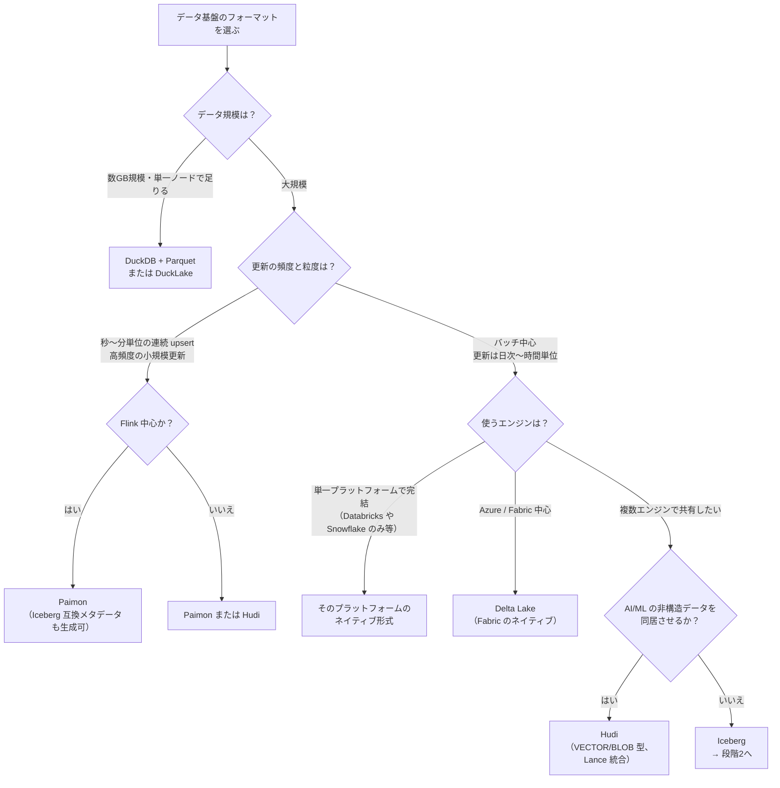
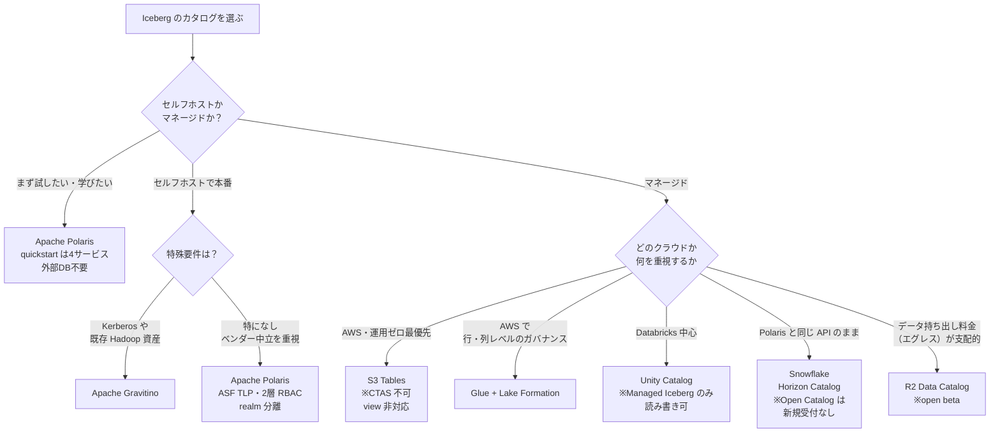
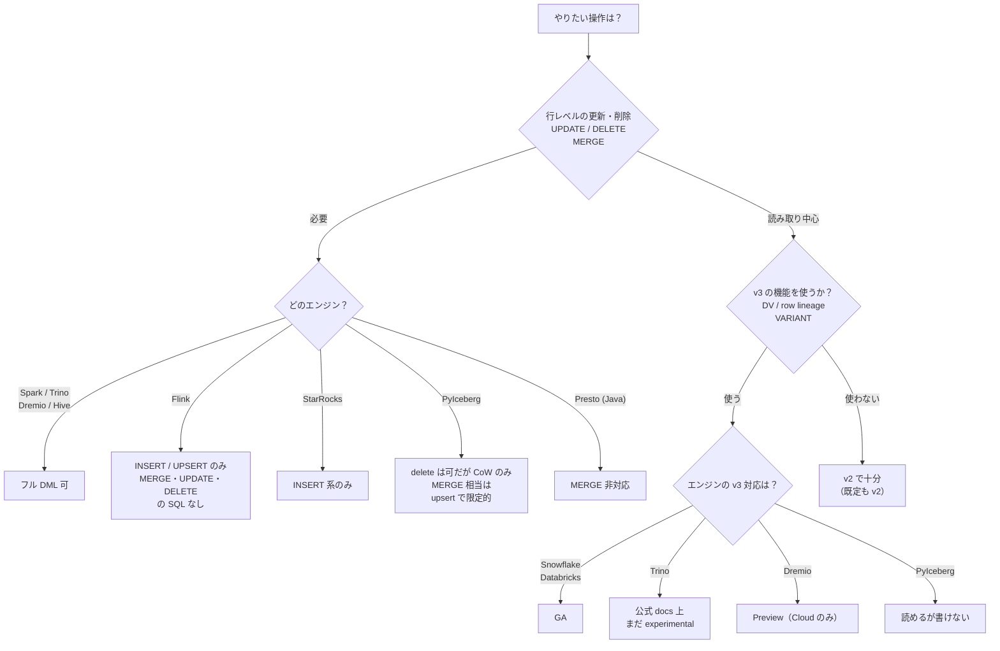

# 08. 選定ガイド（要求から技術選択へ）

**調査基準日: 2026-07-17**

この章に新しい事実はありません。[02](02-table-spec.md)〜[07](07-ecosystem.md) で個別に述べた判断材料を、**要求から選択にたどり着く順序**に組み替えたものです。各分岐の根拠は元の章へリンクしています。

判断は3段階に分かれます。**上流の選択が下流を制約する**ので、この順に決めるのが手戻りが少なくなります。

1. **フォーマット** — Iceberg を使うのか、他が適しているのか
2. **カタログ** — Iceberg を選んだ場合、どのカタログか
3. **エンジン** — やりたい操作がそのエンジンで本当にできるか

---

## 段階1: フォーマットを選ぶ

Iceberg が常に最適とは限りません。設計上の性質から不向きなケースがあります（詳細は [07 C章](07-ecosystem.md#c-iceberg-を使うべきでない場面)）。

各分岐の根拠:

| 分岐 | 理由 | 詳細 |
|---|---|---|
| 小規模データ | カタログ運用・compaction・スナップショット期限切れの保守コストが利得を上回る | [C-3](07-ecosystem.md#c-3-小規模データ) |
| 連続 upsert / 高頻度更新 | Iceberg は OCC でコミットごとに書き込み増幅が効く。Paimon は bucket ごとの LSM-tree で compaction を内包 | [C-1](07-ecosystem.md#c-1-低レイテンシ高頻度コミットのストリーミング), [C-2](07-ecosystem.md#c-2-頻繁な小規模更新--更新が激しい-cdc) |
| Flink 中心 | Iceberg の Flink 連携は INSERT/UPSERT のみで MERGE/UPDATE/DELETE の SQL が無い。Paimon は Flink Table Store 由来 | [C-5](07-ecosystem.md#c-5-flink-中心のストリーミング特化) |
| 単一プラットフォーム | Iceberg の存在理由はエンジン非依存の共有。1つで完結するならネイティブ形式の最適化を享受できる | [C-4](07-ecosystem.md#c-4-単一エンジンしか使わない) |
| Azure / Fabric | OneLake のネイティブは Delta。Iceberg は仮想化経由で V3 互換は未完了 | [C-6](07-ecosystem.md#c-6-azurefabric-中心の環境) |
| AI/ML の非構造データ | Iceberg 1.11.0 に VECTOR/BLOB 相当の型は確認できず。Hudi 1.2.0 が対応 | [C-7](07-ecosystem.md#c-7-aiml-の非構造データを同居させたい) |

> **後戻りは以前より容易です。** UniForm（Delta→Iceberg）、Paimon の Iceberg 互換メタデータ、OneLake のメタデータ仮想化により、「主要ワークロードに最適な形式で書き、他形式は公開で賄う」が現実的になっています。ただしこの相互運用は**ベンダー実装が担っており、ベンダー中立の XTable は停滞している**点は認識しておくべきです（[A-4](07-ecosystem.md#a-4-相互運用--xtable-は実測で停滞)）。

---

## 段階2: カタログを選ぶ

Iceberg を選んだら、次はカタログです。**フォーマットより重い選択になりうる**点に注意してください。Databricks UC のように「そのカタログを使うこと」が条件になる実装があり、フォーマットが Iceberg でもカタログでロックインされます（[07 D](07-ecosystem.md#d-実務上の含意)）。

選定時に効く制約（詳細は [04](04-catalog-implementations.md#選定指針)）:

| 選択肢 | 見落としやすい制約 |
|---|---|
| **S3 Tables** | **CTAS 不可**（stage-create なし）、**view 非対応**。さらに**タグやブランチを1つ作るだけで自動スナップショット管理がテーブル全体で停止**（fail-closed）し、失敗は課金増加としてしか現れない → [06 C-1](06-operations.md#c-1-amazon-s3-tables) |
| **Databricks UC** | Managed Iceberg のみ読み書き可。**Foreign Iceberg は読み取り専用で credential vending 非対応**。また **IRC 接続は一方通行**で、外部エンジンが UC に繋ぎに来ることはできても、**Databricks が Polaris など他のカタログへ繋ぎに行くことはできません**（既存カタログがある場合、UC に寄せる必要が生じます） |
| **Snowflake Open Catalog** | **新規顧客はサインアップできない**（Horizon へ誘導）。既存顧客は継続利用可 |
| **Lakekeeper** | 技術的な出来は良いが **pre-1.0・実質コア2名・公表採用事例ゼロ**。リスクを取れる場合の選択肢 |
| **Hadoop catalog** | **オブジェクトストレージで安全でない**。仕様も deprecated としており v4 で削除予定。推奨代替は **JDBC catalog** → [04](04-catalog-implementations.md#hadoop-catalog-は本番使用不可) |

> **用語**: **エグレス費用**（egress cost）は、クラウドから**データを外部へ持ち出すときにかかる通信料金**です。ストレージに置くことや同一クラウド内で読むことは安価でも、インターネットや他社クラウドへ出すと GB 単位で課金されます。複数クラウドにまたがって同じテーブルを共有する構成では、これが総コストを左右することがあります。

---

## 段階3: エンジンで「本当にできるか」を確認する

最後に、**やりたい操作がそのエンジンで実際にできるか**を確認します。ここを飛ばすと、カタログまで決めた後で「この DML が書けない」と気づくことになります。

**確認すべき代表的な落とし穴**（詳細は [05](05-engine-support.md)）:

| 前提しがちなこと | 実際 |
|---|---|
| 「v3 にすれば deletion vector が使われる」 | **既定は copy-on-write のまま**。`write.delete.mode` を明示しない限り DV は使われない → [02](02-table-spec.md#デフォルトは-cow重要) |
| 「PyIceberg で一通りできる」 | **v3 を書けない / equality delete を読めない / MoR は CoW に落ちる / compaction が無い** → [05](05-engine-support.md#pyiceberg) |
| 「Trino は v3 対応済み」 | PR はマージ済みだが **docs は experimental** とし、row-level updates/deletes/OPTIMIZE を非対応と明記 |
| 「Flink で CDC を組んで row lineage で追跡する」 | **equality delete を使うエンジンでは row lineage は追跡されない** → [02](02-table-spec.md#row-lineage-の重大な制約-equality-delete-では追跡されない) |
| 「マネージドなら運用は不要」 | compaction と GC は肩代わりされるが、**パーティション設計・sort order・`write.metadata.delete-after-commit.enabled` の初期設定は自分の責任** → [06](06-operations.md#c-3-マネージド自動メンテナンスの共通の限界) |

---

## 使い方の注意

このチャートは**典型的なケースを最短で絞り込む**ためのもので、すべての要求を尽くしてはいません。とくに以下は分岐に含めていません。

- **既存資産との整合**（すでに動いている基盤、社内の運用スキル）
- **コンプライアンス要件**（データ所在地、監査要件）
- **コスト構造**（エグレス、コンピュート課金の形）

いずれも実際の選定では支配的な要因になりえます。チャートで絞り込んだ候補を、これらの観点で再評価してください。

また、**ベンダーの対応状況は数ヶ月で変わります**。GA / Preview の別やバージョン番号を判断に使う場合は、[各章の出典](05-engine-support.md#出典)から一次情報を再確認してください。
